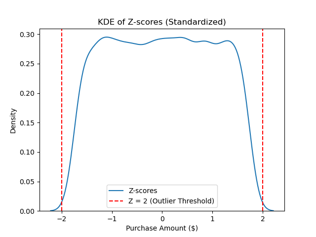
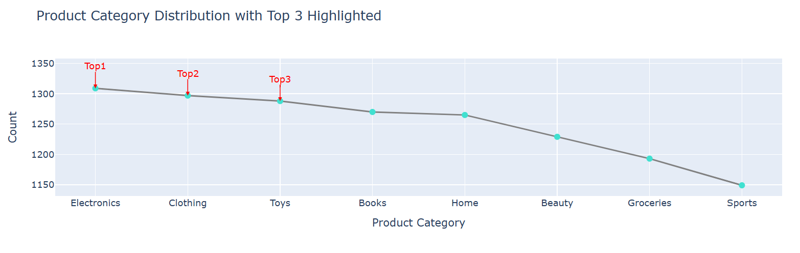
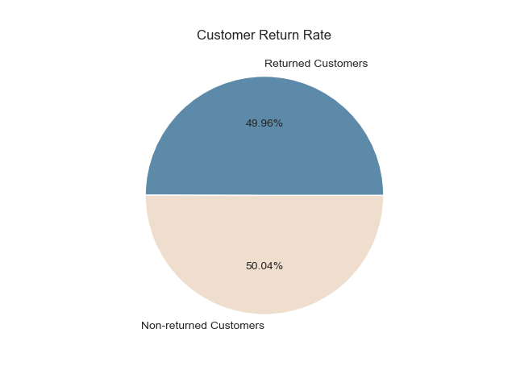
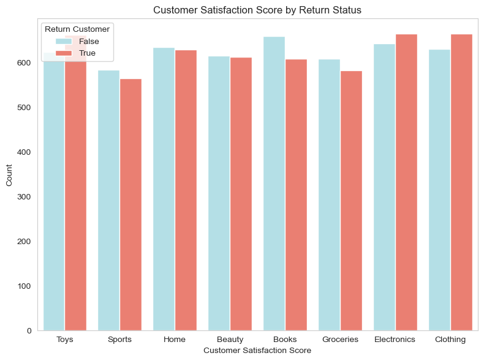
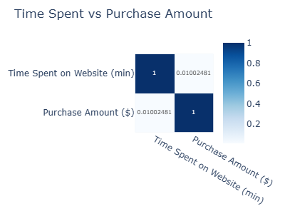
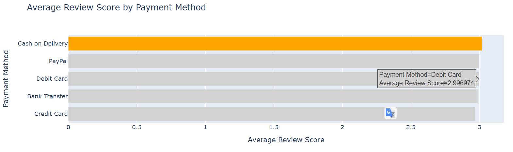
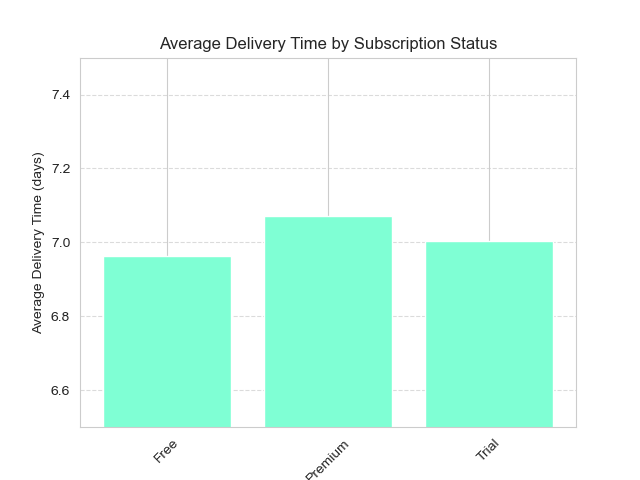
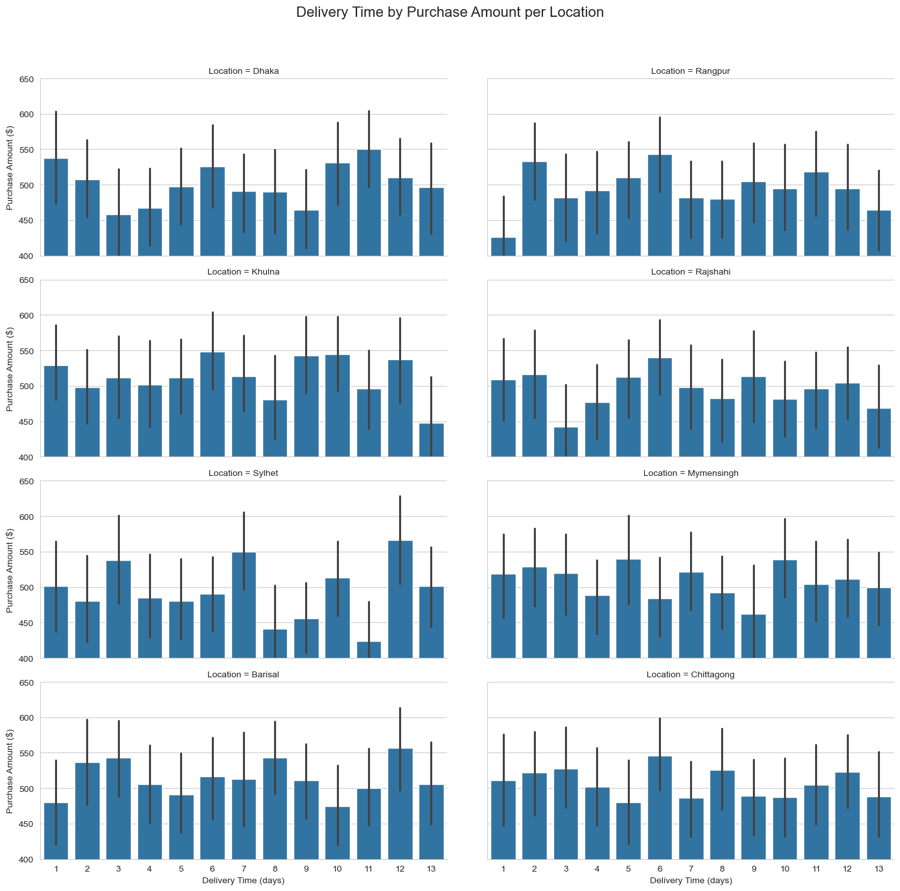
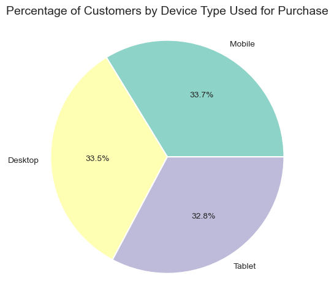

# E-Commerce Customer Behavior Analysis


## Overview

This project analyzes customer transaction and behavioral data from an e-commerce platform to uncover patterns in purchasing habits, product preferences, delivery performance, and customer satisfaction. The dataset spans 10,000 customers across multiple regions in Bangladesh, capturing demographic details, purchase behavior, payment preferences, and post-purchase outcomes such as returns and satisfaction ratings.

The analysis was performed to help the business better understand *why* customers buy, *what* drives them to return products, and *how* factors like delivery time, discounts, payment method, and subscription tier influence spending and satisfaction. Rather than treating these as isolated metrics, the project connects them into a single behavioral picture of the customer base.

The core business objective is to translate raw transactional data into decisions that reduce return rates, improve customer retention, and increase conversion from free to premium subscriptions — all while identifying which product categories, regions, and customer segments deserve the most operational focus.

The expected outcome is a set of data-backed recommendations covering inventory prioritization, delivery logistics, discount strategy, and UX improvements that a product, marketing, or operations team could act on directly.

## Objectives

- Understand the demographic and behavioral profile of the customer base
- Identify the most and least popular product categories
- Quantify return rates and the factors associated with returns
- Evaluate how delivery time, payment method, and device type affect satisfaction
- Test whether browsing time and purchase volume actually correlate with spending and satisfaction
- Compare regional performance in terms of purchase amount and delivery speed
- Assess the effectiveness of discounts and premium subscriptions in driving revenue
- Translate findings into concrete, actionable business recommendations

## Dataset Overview

- **Records:** 10,000 customers
- **Columns:** 16
- **Missing values:** None
- **Duplicate rows:** None
- **Source:** `ecommerce_customer_behavior_dataset.csv` (included in `dataset/`)

**Key variables:**
- Demographics: `Age`, `Gender`, `Location`
- Behavior: `Product Category`, `Purchase Amount ($)`, `Time Spent on Website (min)`, `Number of Items Purchased`, `Device Type`, `Payment Method`, `Discount Availed`
- Outcomes: `Return Customer`, `Review Score (1–5)`, `Customer Satisfaction`, `Delivery Time (days)`, `Subscription Status`

**Core business metrics:** purchase amount, return rate, customer satisfaction score, and delivery time — used throughout the analysis as the primary indicators of business health.

## Tech Stack

- Python
- Pandas
- NumPy
- Matplotlib
- Seaborn
- Plotly Express
- Jupyter Notebook

## Data Preparation

- Verified the dataset for missing values and duplicate rows — none were found, so no imputation or row removal was required
- Renamed ambiguous columns (`Review Score (1-5)` → `Review Score`, `Customer Satisfaction` → `Customer Satisfaction Score`) for clarity
- Converted the categorical `Customer Satisfaction Score` (Low/Medium/High) into a numeric scale (1/2/3) to support correlation and grouped analysis
- Reviewed unique values across all columns to confirm data consistency (e.g., valid category labels, device types, and locations)
- Computed z-scores on `Purchase Amount ($)` to check for outliers and understand the distribution shape

## Exploratory Data Analysis

The customer base skews toward middle-aged shoppers (average age ~44), a segment typically associated with stable income and purchasing power. Purchase amounts are fairly evenly distributed with no dominant price point, and nearly all transactions fall within ±2 standard deviations of the mean — indicating consistent spending behavior with few extreme outliers.

Electronics, Clothing, and Toys are the top three product categories by order volume, while Beauty, Groceries, and Sports lag significantly behind. Device usage is nearly evenly split across Mobile, Desktop, and Tablet, suggesting the platform draws a broad, cross-device audience. Bank Transfer is the most-used payment method, followed closely by Credit Card and Debit Card.

The most striking finding is the return rate: roughly half of all customers return at least one product, paired with a neutral average review score of 3.0 out of 5. This signals a meaningful gap between customer expectations and the actual product or delivery experience — a theme that recurs across nearly every dimension of the analysis.

## Key Visualizations

### Purchase Amount Distribution (Z-Score)

This KDE plot shows the standardized distribution of purchase amounts with outlier thresholds marked at ±2 standard deviations. The flat, evenly spread shape confirms there is no single dominant spending tier, and extreme purchase values are rare — indicating a broadly consistent spending pattern across the customer base.

### Top 3 Product Categories

Electronics, Clothing, and Toys lead in order volume, closely followed by one another. This tells the business exactly where to concentrate inventory and promotional spend, while flagging under-performing categories that may need repositioning or bundling.

### Return Rate Overview

Nearly 50% of customers have returned a product, making this one of the most business-critical metrics in the dataset. A return rate this high, paired with a neutral review average, points to systemic issues in product quality, delivery, or expectation-setting rather than isolated incidents.

### Product Category by Return Status

Electronics and Toys show disproportionately high return counts relative to their order volume. Electronics returns likely stem from product sensitivity and unmet expectations, while Toys — despite lower order volume — show quality-related dissatisfaction, making both categories priorities for quality control review.

### Time Spent on Website vs. Purchase Amount

Despite intuition suggesting longer browsing leads to bigger purchases, the correlation between time spent and purchase amount is effectively zero (r = 0.01). This challenges any strategy built around "engagement time" as a proxy for purchase intent, and instead points to friction or decision-making issues in the browsing experience.

### Average Review Score by Payment Method

Cash on Delivery, despite being associated with the highest review score numerically, shows consistently weaker satisfaction patterns when segmented by return status — highlighting COD as an operational pain point worth investigating further, particularly around delivery friction and payment trust.

### Average Delivery Time by Subscription Status

Premium and Free subscribers experience nearly identical delivery times (~7 days), removing one of the core value propositions premium customers would expect. This directly explains weak conversion incentive from Free to Premium tiers.

### Customer Spending: Discount vs. Non-Discount
.png)
Customers who use discounts do not spend meaningfully more than those who don't, suggesting that flat discounts are not an effective lever for increasing basket size and may simply be subsidizing purchases that would have happened anyway.

### Regional Purchase Amount and Delivery Time

Barisal, Khulna, and Sylhet show the highest average purchase amounts despite longer delivery windows (10–13 days), while Rangpur and Mymensingh underperform regardless of delivery speed. This identifies which regions deserve logistics investment and which need a different growth strategy entirely.

### Device Usage Distribution

Purchase share is nearly evenly split across Mobile (33.7%), Desktop, and Tablet, confirming that the platform reaches a diverse technical audience and that UX investment needs to be distributed across all three surfaces rather than concentrated on one.

## Statistical Analysis

- **Descriptive statistics:** Mean, median, and mode were calculated for customer age and purchase amount to characterize the typical customer profile
- **Variance & standard deviation:** Computed for `Purchase Amount ($)` using both NumPy and manual formula validation, confirming a variance of ~81,924
- **Z-score standardization:** Applied to purchase amounts to detect outliers and assess distribution shape; nearly all values fall within ±2 SD
- **Correlation analysis:** Pearson correlation between `Time Spent on Website` and `Purchase Amount` (r ≈ 0.01, effectively no relationship), and between `Number of Items Purchased` and `Customer Satisfaction Score` (negligible correlation)
- **Grouped comparative analysis:** Mean review scores and purchase amounts compared across payment methods, subscription status, device types, and regions to isolate segment-level effects

## Key Insights

- The average customer is ~44 years old, indicating a financially stable, middle-aged core audience
- Nearly 50% of customers return at least one product — a critical retention and profitability risk
- Average review score sits at a neutral 3.0/5, reflecting lukewarm rather than strongly negative or positive sentiment
- Electronics, Clothing, and Toys drive the majority of orders; Beauty, Groceries, and Sports significantly underperform
- Electronics and Toys show disproportionately high return rates relative to their popularity
- Time spent on the website has virtually no correlation with purchase amount (r ≈ 0.01) — browsing duration is not a buying signal
- Number of items purchased does not correlate with customer satisfaction — buying more does not equal being happier
- Premium and Free subscribers receive nearly identical delivery times, weakening the incentive to upgrade
- Discount usage does not meaningfully increase purchase amount, suggesting discounts attract price-sensitive rather than high-value shoppers
- Cash on Delivery consistently underperforms on customer satisfaction compared to digital payment methods
- Purchase behavior is nearly evenly split across Mobile, Desktop, and Tablet — no single device dominates
- Barisal, Khulna, and Sylhet are high-spending regions despite longer delivery times, indicating demand that isn't primarily price- or speed-driven

## Business Recommendations

1. **Prioritize quality control for Electronics and Toys** — these categories combine high order volume (or high customer expectations) with elevated return rates
2. **Redesign the Premium subscription value proposition**, starting with a measurable delivery-speed advantage over Free tier customers
3. **Replace flat, single-item discounts with tiered or bundled offers** to increase basket size rather than simply subsidizing existing demand
4. **Investigate and overhaul the Cash on Delivery experience**, focusing on communication, tracking transparency, and delivery reliability
5. **Launch a targeted post-return survey** to capture the specific reasons behind the ~50% return rate rather than relying on inferred causes
6. **Invest in regional logistics optimization** for high-spending, high-delivery-time regions (Barisal, Khulna, Sylhet) rather than applying a uniform national delivery strategy
7. **Improve on-site product discovery** (search, filters, personalized recommendations) since longer browsing time is not translating into higher spend — a sign of friction, not disengagement
8. **Maintain cross-device UX parity** across Mobile, Desktop, and Tablet given the near-even usage split across all three
9. **Bundle underperforming categories (Beauty, Groceries, Sports) with top-performing ones** to increase their visibility and trial
10. **Build a re-engagement campaign for returned-but-satisfied customers**, a segment that shows the platform can convert dissatisfaction into repeat interest if approached correctly

## Conclusion

This analysis reframes what looks like a stable, evenly-performing e-commerce platform into one with a clear underlying problem: nearly half of all customers return products, and neither browsing time, item count, nor discounts meaningfully move the needle on satisfaction or spend. The real levers are structural — delivery reliability, payment experience, and category-specific quality control — rather than promotional. Addressing these areas directly, particularly around Electronics, Toys, and Cash on Delivery, offers the clearest path to reducing returns and building a stronger case for premium subscription adoption.

## Project Structure

```
.
├── dataset/
├── images/
├── project.ipynb
├── project.html
└── README.md
```
